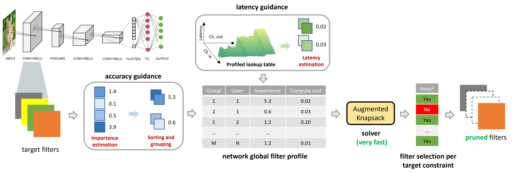

# Structural Pruning via Latency-Saliency Knapsack

This repository is the official PyTorch implementation of NeurIPS 2022 paper [Structural Pruning via Latency-Saliency Knapsack](https://openreview.net/forum?id=cUOR-_VsavA).

Useful links:
* [project page]()
* [ArXiv Full]()
* [ArXiv HALP: Hardware-Aware Latency Pruning](https://arxiv.org/abs/2110.10811)

[](https://github.com/NVlabs/HALP/blob/master/assets/pipeline.png)

## License


## Requirements
1. Prepare Environment

    To run the code and reproduce the results, it is highly recommended to create the docker image using [Dockerfile](Dockerfile).

    Alternatively, please run the code with virtual environment with Python 3.6, and install the necessary packages:
    ```
    pip install torch==1.4.0
    pip install torchvision==0.5.0
    pip install numpy
    pip install Pillow
    pip install PyYAML
    pip install pandas
    ```
    Additionally install APEX library for FP16 support: [Installing NVIDIA APEX](https://github.com/NVIDIA/apex#quick-start)

2. Download Pretrained Models

    We provide the pretrained baseline models in [Google Drive](https://drive.google.com/drive/folders/1YebNJp1zjHb2RbeJolfO6yxiWvQSpQmQ?usp=sharing). Please download and put the pretrained models in the folder `model_ckpt/`.

3. Download Latency LUT

    The latency lookup table is provided: [ResNet50_on_TitanV](https://drive.google.com/file/d/172TcEREnaS7fH_WKw-8pNppRSY_GKTKu/view?usp=sharing)

    Please download the latency lookup table file and put it under folder `LUT/`.

4. Prepare Data
    
    Download the [ImageNet1K](https://image-net.org/download.php) and modify the `data_root` in [config file](configs/exp_configs/rn50_imagenet_prune.yaml) to the correct path accordingly.

## Running the code

Train a ResNet50 baseline
```
python multiproc.py --nproc_per_node 8 main.py --exp configs/exp_configs/rn50_imagenet_baseline.yaml --no_prune
```

Prune a ResNet50
```
python multiproc.py --nproc_per_node 8 main.py --exp configs/exp_configs/rn50_imagenet_prune.yaml --pretrained model_ckpt/resnet50_full.pth
```

Evaluate a (prune/unpruned) ResNet50
```
python multiproc.py --nproc_per_node 8 main.py --pretrained model_ckpt/resnet50_halp55.pth --eval_only
```

Measure the actualy latency of a pruned model
```
python profile.py --model_path model_ckpt/resnet50_halp55_clean.pth --mask_path model_ckpt/resnet50_halp55_group_mask.pkl
```

## Results on ImageNet
| Model | FLOPs | Top-1 Acc | Top-5 Acc | FPS | Checkpoint |
| ---- | ---- | ---- | ---- | ---- | ---- |
| ResNet50 | 2.998G | 77.44 | 93.74 | 1213 | [RN50-HALP80](https://drive.google.com/drive/folders/12L9Ar7tBZ3Xz7g1ba3vd483wBxy3qMa4?usp=sharing) |
|          | 1.957G | 76.47 | 93.11 | 1674 | [RN50-HALP55](https://drive.google.com/drive/folders/13aCyXIsAuOK1wApEJC9k63mHA44JdnRm?usp=sharing) |
|          | 1.113G | 74.41 | 91.85 | 2610 | [RN50-HALP30](https://drive.google.com/drive/folders/1MdG7tOI5UUIFUqU88Eroz9QNGQIRbbsF?usp=sharing) |
